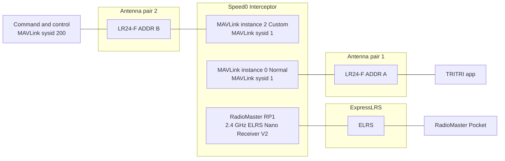
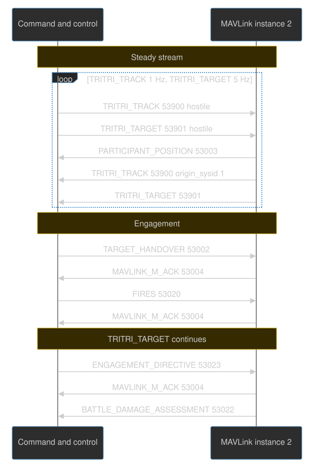
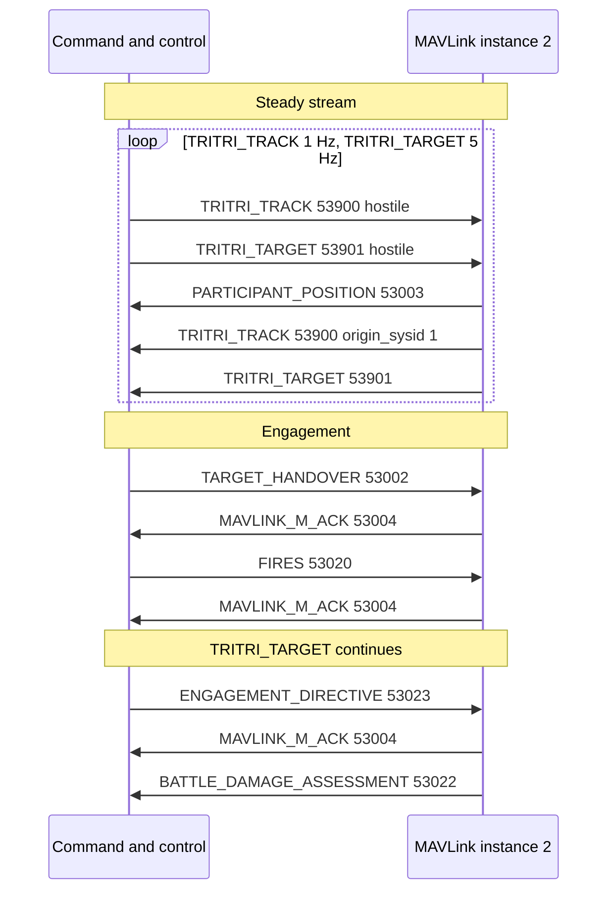
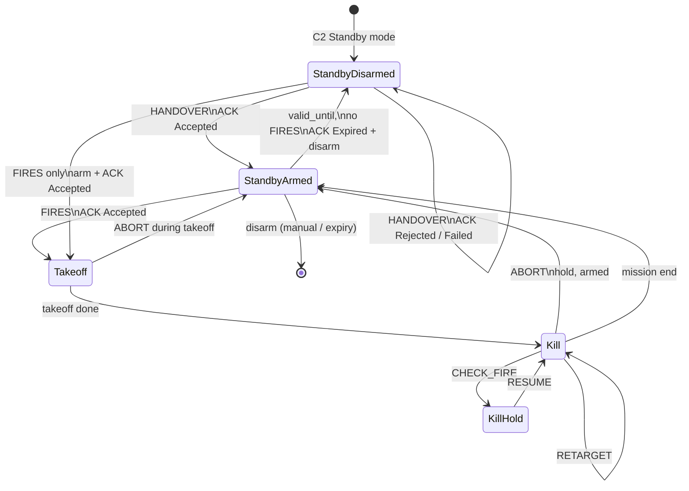

# Command and control integration — TRITRI / MAVLink-M

## Communication architecture

Speed0 is equipped with two LR24-F radios.

The first (ADDR B, antenna pair 2) is connected to MAVLink instance 2 (Custom). That instance receives and transmits a lean subset of MAVLink-M plus TRITRI_TRACK and TRITRI_TARGET to **command and control**.

The second (ADDR A, antenna pair 1) is connected to MAVLink instance 0 (Normal). That instance is the general telemetry and control link to the **TRITRI app**.

**RadioMaster Pocket** acts as a manual override and kill switch.

Mermaid source

## Protocol

Speed0 uses MAVLink 2 dialect **tritri** on all MAVLink links. The dialect root is [`tritri.xml`](../tritri.xml): it includes the standard MAVLink message set and [`military.xml`](../military.xml) (MAVLink-M, `53000–53099`), and adds two private messages in `53900–53999`: **TRITRI_TRACK** (53900) and **TRITRI_TARGET** (53901). **TRITRI_TRACK** and **TRITRI_TARGET** are the live common-operating-picture types on the C2 link—lean equivalents of **TRACK_IDENTITY** (53000) and **TARGET** (53010), with non-essential fields removed for low-bandwidth LoRa radios.

### C2 side

Traffic on antenna pair 2 between command and control and MAVLink instance 2.

Mermaid source

### Engagement workflow

Speed0 vehicle states (arm, takeoff, intercept, abort, disarm):

Mermaid source

The LR24-F link is bandwidth-limited. Command and control uses MAVLink instance 2 in **Custom** mode with a lean message set only.

Speed0 receives on instance 2 from C2:

- TRITRI_TRACK (53900) — 1 Hz — hostile identity
- TRITRI_TARGET (53901) — 5 Hz — hostile kinematics, same track_uid as TRITRI_TRACK
- TARGET_HANDOVER (53002) — on event — assign track
- FIRES (53020) — on event — start intercept
- ENGAGEMENT_DIRECTIVE (53023) — on event — abort, check-fire, resume, or retarget
- HEARTBEAT (0) — 1 Hz

Speed0 transmits on instance 2 to C2:

- HEARTBEAT (0) — 1 Hz
- PARTICIPANT_POSITION (53003) — 5 Hz
- TRITRI_TRACK (53900) — 1 Hz — seeker-identified from onboard camera
- TRITRI_TARGET (53901) — 5 Hz — seeker-identified from onboard camera
- MAVLINK_M_ACK (53004) — on event
- BATTLE_DAMAGE_ASSESSMENT (53022) — on event

Attitude, GPS, battery, and other flight telemetry use instance 0 (Normal) to the TRITRI app. Traffic heard on instance 2 is forwarded to instance 0.

C2 sysid **200**, Speed0 sysid **1**. C2 streams the hostile on TRITRI_TRACK / TRITRI_TARGET; Speed0 also publishes what its onboard AI detects (`origin_sysid` 1).

**C2-path:** HANDOVER then FIRES (hostile `track_uid`).

**Seeker-direct-path:** FIRES only (seeker `track_uid`).

**BDA** closes either path — on event; `track_uid` matches FIRES.

### Message definitions

#### C2 → Speed0

##### TRITRI_TRACK (53900)

Hostile track identity from C2. 65 B on wire (53 B payload). Stream at 1 Hz.

| Field                 | Type      | Example            | Description                                            |
| --------------------- | --------- | ------------------ | ------------------------------------------------------ |
| `time_usec`           | uint64    | `1723728000123456` | Message timestamp, UNIX UTC, microseconds              |
| `first_detected_usec` | uint64    | `1723727995000000` | First detection time, UNIX UTC, microseconds           |
| `track_uid`           | uint8[16] | `7c3e9a2b…`        | Globally-unique track identifier (UUID)                |
| `target_set_id`       | uint32    | `0`                | Associated target set identifier; 0 = none             |
| `id_confidence`       | float     | `0.85`             | Identification confidence 0.0–1.0; NaN if not provided |
| `atr_model_id`        | uint16    | `1001`             | ATR model/version id; 0 = unspecified                  |
| `origin_sysid`        | uint8     | `200`              | System ID of track owner                               |
| `origin_sensor`       | enum      | `RADAR`            | Sensor/method behind identification                    |
| `id_method`           | enum      | `AUTOMATED_ATR`    | Method by which identification was reached             |
| `pid_status`          | enum      | `POSITIVE`         | Positive identification status                         |
| `target_class`        | enum      | `UAS_MULTIROTOR`   | Classification                                         |
| `target_force`        | enum      | `FOE`              | Force affiliation                                      |
| `stanag_identity`     | enum      | `HOSTILE`          | STANAG/APP-6 standard identity                         |
| `environment`         | enum      | `AIR`              | STANAG/APP-6 battle dimension                          |
| `atr_confidence_pct`  | uint8     | `72`               | ATR confidence 0–100; 255 = N/A                        |
| `atr_conf_tier`       | enum      | `MEDIUM`           | Advisory display tier                                  |
| `sidc_context`        | enum      | `REALITY`          | Reality vs exercise vs simulation                      |

##### TRITRI_TARGET (53901)

Hostile kinematics from C2. 128 B on wire. Stream at 5 Hz.

| Field                     | Type      | Example            | Description                                      |
| ------------------------- | --------- | ------------------ | ------------------------------------------------ |
| `time_usec`               | uint64    | `1723728000500000` | Message timestamp, UNIX UTC, microseconds        |
| `target_time_usec`        | uint64    | `1723728000498000` | Timestamp when the target fix was valid          |
| `track_uid`               | uint8[16] | `7c3e9a2b…`        | Track UID correlating to TRITRI_TRACK            |
| `target_name`             | char[16]  | `hostile_uas`      | Short human-readable callsign                    |
| `target_id`               | uint32    | `42`               | Unique target identifier from source system      |
| `target_set_id`           | uint32    | `0`                | Parent target set identifier; 0 = none           |
| `flags`                   | uint32    | `32`               | Target warning and status flags                  |
| `lat`                     | int32     | `461234567`        | Latitude degE7, WGS84; INT32_MAX if unknown      |
| `lon`                     | int32     | `145678901`        | Longitude degE7, WGS84; INT32_MAX if unknown     |
| `alt`                     | float     | `152.3`            | Altitude MSL, metres; NaN if unknown             |
| `vx`                      | float     | `12.5`             | Velocity north, m/s NED; NaN if unknown          |
| `vy`                      | float     | `-3.2`             | Velocity east, m/s NED; NaN if unknown           |
| `vz`                      | float     | `0.1`              | Velocity down, m/s NED; NaN if unknown           |
| `cov_pos_x`               | float     | `25.0`             | Position covariance north, m²; NaN if unknown    |
| `cov_pos_y`               | float     | `25.0`             | Position covariance east, m²; NaN if unknown     |
| `cov_pos_z`               | float     | `49.0`             | Position covariance down, m²; NaN if unknown     |
| `cov_vel_x`               | float     | `4.0`              | Velocity covariance north, m²/s²; NaN if unknown |
| `cov_vel_y`               | float     | `4.0`              | Velocity covariance east, m²/s²; NaN if unknown  |
| `cov_vel_z`               | float     | `4.0`              | Velocity covariance down, m²/s²; NaN if unknown  |
| `confidence`              | uint16    | `7200`             | Detection confidence 0–10000                     |
| `target_class`            | enum      | `UAS_MULTIROTOR`   | Target classification                            |
| `target_domain`           | enum      | `AIR`              | Primary operating domain                         |
| `target_force`            | enum      | `FOE`              | Force affiliation                                |
| `sensor_type`             | enum      | `RADAR`            | Primary sensor source                            |
| `tle_category`            | uint8     | `2`                | Target-location-error category; 0 if unset       |
| `restricted_target_flags` | uint8     | `0`                | No-strike / restricted flags; 0 if none          |

##### TARGET_HANDOVER (53002)

Assign hostile track to Speed0. 219 B on wire. On event.

Speed0 loads the track and **arms if needed** — it **does not launch** until **FIRES**. It replies with **MAVLINK_M_ACK** after the arm attempt: `Accepted` if ready, or `Rejected` / `Failed` / `Expired` with `reason` (e.g. arm failed). If FIRES is not received before `valid_until_usec`, Speed0 ACKs `Expired`, **auto-disarms**, and clears the handover.

| Field                 | Type      | Example            | Description                                         |
| --------------------- | --------- | ------------------ | --------------------------------------------------- |
| `time_usec`           | uint64    | `1723728001000000` | Message timestamp, UNIX UTC, microseconds           |
| `detected_first_usec` | uint64    | `1723727995000000` | First detection time, UNIX UTC, microseconds        |
| `valid_until_usec`    | uint64    | `1723728100000000` | Handover expires at this time if FIRES not received |
| `lat`                 | int32     | `461234567`        | Target latitude degE7, WGS84                        |
| `lon`                 | int32     | `145678901`        | Target longitude degE7, WGS84                       |
| `alt`                 | float     | `152.3`            | Target altitude MSL, metres                         |
| `vx`                  | float     | `12.5`             | Velocity north, m/s NED                             |
| `vy`                  | float     | `-3.2`             | Velocity east, m/s NED                              |
| `vz`                  | float     | `0.1`              | Velocity down, m/s NED                              |
| `cov_pos_x`           | float     | `25.0`             | Position covariance north, m²                       |
| `cov_pos_y`           | float     | `25.0`             | Position covariance east, m²                        |
| `cov_pos_z`           | float     | `49.0`             | Position covariance down, m²                        |
| `cov_vel_x`           | float     | `4.0`              | Velocity covariance north, m²/s²                    |
| `cov_vel_y`           | float     | `4.0`              | Velocity covariance east, m²/s²                     |
| `cov_vel_z`           | float     | `4.0`              | Velocity covariance down, m²/s²                     |
| `target_set_id`       | uint32    | `0`                | Parent target set identifier                        |
| `target_name`         | char[50]  | `hostile_uas`      | Human-readable target name                          |
| `match_media_url`     | char[50]  | ``                 | URL to matching media asset                         |
| `confidence_score`    | float     | `0.85`             | Identification confidence 0.0–1.0                   |
| `authorization`       | uint8[8]  | all zero           | Opaque authorization token                          |
| `target_class`        | enum      | `UAS_MULTIROTOR`   | Target classification                               |
| `target_force`        | enum      | `FOE`              | Force affiliation                                   |
| `match_media_type`    | enum      | `NONE`             | Type of matching media                              |
| `track_uid`           | uint8[16] | `7c3e9a2b…`        | Track UID of the TRACK_IDENTITY transferred         |

##### FIRES (53020)

Start intercept. 74 B on wire. On event. `lat`/`lon`/`alt` are the predicted intercept point (PIP); `time_impact_usec` is expected time of impact (TOA). Speed0 replies with **MAVLINK_M_ACK** (`Accepted` or `Failed`/`Rejected` with `reason`), then **launches** toward PIP. Midcourse follows live **TRITRI_TARGET** for the FIRES `track_uid` (C2 hostile or seeker); terminal prefers onboard seeker kinematics when locked.

| Field               | Type      | Example            | Description                                           |
| ------------------- | --------- | ------------------ | ----------------------------------------------------- |
| `time_usec`         | uint64    | `1723728002000000` | Message timestamp, UNIX UTC, microseconds             |
| `time_impact_usec`  | uint64    | `1723728008000000` | Expected time of impact (TOA), UNIX UTC, microseconds |
| `lat`               | int32     | `461240000`        | PIP latitude degE7, WGS84                             |
| `lon`               | int32     | `145685000`        | PIP longitude degE7, WGS84                            |
| `alt`               | float     | `155.0`            | PIP altitude MSL, metres                              |
| `effector_id`       | uint32    | `1`                | Identifier of the assigned effector                   |
| `sequence`          | uint16    | `1`                | Fire mission sequence number                          |
| `cep_expected`      | float     | `10.0`             | Expected CEP at impact, metres                        |
| `prf_code`          | uint16    | `0`                | Laser PRF code; 0 if none                             |
| `store_id`          | uint8     | `0`                | Store id; 0 = vehicle (OWA)                           |
| `requested_effect`  | enum      | `IMPACT`           | Coarse requested effect                               |
| `munition_class`    | enum      | `UNKNOWN`          | Munition class                                        |
| `fuze_mode`         | enum      | `UNKNOWN`          | Fuze mode                                             |
| `hob_intent`        | enum      | `0`                | Height-of-burst intent                                |
| `fuze_mofa_capable` | uint8     | `0`                | Multi-option fuze capable flag                        |
| `track_uid`         | uint8[16] | `7c3e9a2b…`        | Track UID of the TRACK_IDENTITY                       |

##### ENGAGEMENT_DIRECTIVE (53023)

Abort, hold, resume, or retarget during an active intercept. 56 B on wire. On event. Speed0 ACKs each directive. Correlates to the active FIRES via `track_uid` and `sequence`. `retarget_lat`/`retarget_lon`/`retarget_alt` are used for `RETARGET` only.

| Field          | Type      | Example            | Description                                                 |
| -------------- | --------- | ------------------ | ----------------------------------------------------------- |
| `time_usec`    | uint64    | `1723728003000000` | Message timestamp, UNIX UTC, microseconds                   |
| `track_uid`    | uint8[16] | `7c3e9a2b…`        | Track UID the directive applies to                          |
| `sequence`     | uint16    | `1`                | Fire mission sequence number (same as FIRES)                |
| `effector_id`  | uint32    | `1`                | Effector addressed; 0 = all assigned                        |
| `retarget_lat` | int32     | `461245000`        | New target latitude degE7 for RETARGET; `INT32_MAX` if N/A  |
| `retarget_lon` | int32     | `145690000`        | New target longitude degE7 for RETARGET; `INT32_MAX` if N/A |
| `retarget_alt` | float     | `158.0`            | New target altitude MSL for RETARGET; NaN if N/A            |
| `directive`    | enum      | `ABORT`            | `ABORT` (0), `CHECK_FIRE` (1), `RESUME` (2), `RETARGET` (3) |
| `origin_sysid` | uint8     | `200`              | System ID issuing the directive                             |

| `directive`  | Speed0 action                                                                    |
| ------------ | -------------------------------------------------------------------------------- |
| `ABORT`      | Stop intercept, clear mission, hold current position; remain armed, await C2     |
| `CHECK_FIRE` | Hold current position; rejected if no active intercept                           |
| `RESUME`     | Continue toward target after check-fire                                          |
| `RETARGET`   | New intercept point from `retarget_lat`/`lon`/`alt`; NACK if coordinates invalid |

#### Speed0 → C2

##### TRITRI_TRACK (53900)

Seeker track identity from onboard AI. 65 B on wire. Stream at 1 Hz.

| Field                 | Type      | Example            | Description                                                  |
| --------------------- | --------- | ------------------ | ------------------------------------------------------------ |
| `time_usec`           | uint64    | `1723728000456789` | Message timestamp, UNIX UTC, microseconds                    |
| `first_detected_usec` | uint64    | `1723728000400000` | First seeker lock time, UNIX UTC, microseconds               |
| `track_uid`           | uint8[16] | (seeker-fixed)     | Globally-unique track identifier (UUID)                      |
| `target_set_id`       | uint32    | `100`              | Associated target set identifier                             |
| `id_confidence`       | float     | `0.85`             | Identification confidence 0.0–1.0                            |
| `atr_model_id`        | uint16    | `1001`             | Onboard AI model id                                          |
| `origin_sysid`        | uint8     | `1`                | Interceptor MAVLink sysid                                    |
| `origin_sensor`       | enum      | `VISUAL_EO`        | Sensor behind identification (`MAVLINK_M_ID_METHOD`)         |
| `id_method`           | enum      | `AUTOMATED_ATR`    | Identification method (`MAVLINK_M_ID_METHOD`)                |
| `pid_status`          | enum      | `TENTATIVE`        | Positive identification status (`MAVLINK_M_PID_STATUS`)      |
| `target_class`        | enum      | `UAS_MULTIROTOR`   | Classification (`MAVLINK_M_TARGET_CLASS`)                    |
| `target_force`        | enum      | `FOE`              | Force affiliation (`MAVLINK_M_TARGET_FORCE`)                 |
| `stanag_identity`     | enum      | `HOSTILE`          | STANAG/APP-6 map symbol identity                             |
| `environment`         | enum      | `AIR`              | STANAG/APP-6 battle dimension                                |
| `atr_confidence_pct`  | uint8     | `85`               | ATR confidence 0–100; 255 = N/A                              |
| `atr_conf_tier`       | enum      | `NA`               | Advisory display tier (`MAVLINK_M_ATR_CONFIDENCE`)           |
| `sidc_context`        | enum      | `REALITY`          | Reality vs exercise vs simulation (`MAVLINK_M_SIDC_CONTEXT`) |

##### TRITRI_TARGET (53901)

Seeker kinematics from onboard AI. 128 B on wire. Stream at 5 Hz.

| Field                     | Type      | Example            | Description                                      |
| ------------------------- | --------- | ------------------ | ------------------------------------------------ |
| `time_usec`               | uint64    | `1723728000500000` | Message timestamp, UNIX UTC, microseconds        |
| `target_time_usec`        | uint64    | `1723728000498000` | Timestamp when the target fix was valid          |
| `track_uid`               | uint8[16] | (seeker-fixed)     | Track UID correlating to TRITRI_TRACK            |
| `target_name`             | char[16]  | `speed0_detected`  | Short callsign (null-terminated)                 |
| `target_id`               | uint32    | `1`                | Seeker-local target id                           |
| `target_set_id`           | uint32    | `100`              | Seeker target set                                |
| `flags`                   | uint32    | `512`              | Target warning and status flags                  |
| `lat`                     | int32     | `461234567`        | Latitude degE7, WGS84; `INT32_MAX` if unknown    |
| `lon`                     | int32     | `145678901`        | Longitude degE7, WGS84; `INT32_MAX` if unknown   |
| `alt`                     | float     | `152.3`            | Altitude MSL, metres; NaN if unknown             |
| `vx`                      | float     | `12.5`             | Velocity north, m/s NED; NaN if unknown          |
| `vy`                      | float     | `-3.2`             | Velocity east, m/s NED; NaN if unknown           |
| `vz`                      | float     | `0.1`              | Velocity down, m/s NED; NaN if unknown           |
| `cov_pos_x`               | float     | `4.0`              | Position covariance north, m²; NaN if unknown    |
| `cov_pos_y`               | float     | `4.0`              | Position covariance east, m²; NaN if unknown     |
| `cov_pos_z`               | float     | `9.0`              | Position covariance down, m²; NaN if unknown     |
| `cov_vel_x`               | float     | `1.0`              | Velocity covariance north, m²/s²; NaN if unknown |
| `cov_vel_y`               | float     | `1.0`              | Velocity covariance east, m²/s²; NaN if unknown  |
| `cov_vel_z`               | float     | `1.0`              | Velocity covariance down, m²/s²; NaN if unknown  |
| `confidence`              | uint16    | `8500`             | AI detection confidence 0–10000 (e.g. 0.85)      |
| `target_class`            | enum      | `UAS_MULTIROTOR`   | Classification                                   |
| `target_domain`           | enum      | `AIR`              | Operating domain                                 |
| `target_force`            | enum      | `FOE`              | Force affiliation                                |
| `sensor_type`             | enum      | `EO`               | Camera (`MAVLINK_M_TARGET_SENSOR_TYPE`)          |
| `tle_category`            | uint8     | `0`                | Target-location-error category; 0 if unset       |
| `restricted_target_flags` | uint8     | `0`                | No-strike / restricted flags; 0 if none          |

##### PARTICIPANT_POSITION (53003)

Interceptor self-position (blue force). 122 B on wire. Stream at 5 Hz.

| Field                   | Type     | Example            | Description                                 |
| ----------------------- | -------- | ------------------ | ------------------------------------------- |
| `time_usec`             | uint64   | `1723728000500000` | Message timestamp, UNIX UTC, microseconds   |
| `lat`                   | int32    | `461200000`        | Interceptor latitude degE7, WGS84           |
| `lon`                   | int32    | `145600000`        | Interceptor longitude degE7, WGS84          |
| `alt`                   | float    | `148.0`            | Altitude MSL, metres; NaN if unknown        |
| `vx`                    | float    | `45.0`             | Velocity north, m/s NED; NaN if unknown     |
| `vy`                    | float    | `2.0`              | Velocity east, m/s NED; NaN if unknown      |
| `vz`                    | float    | `-1.5`             | Velocity down, m/s NED; NaN if unknown      |
| `course`                | float    | `87.4`             | Course over ground, degrees; NaN if unknown |
| `external_track_number` | char[20] | ``                 | External/joint track number; empty if none  |
| `callsign`              | char[50] | `speed0`           | Human-readable callsign                     |
| `origin_sysid`          | uint8    | `1`                | Interceptor MAVLink sysid                   |
| `external_track_type`   | enum     | `0`                | Namespace of `external_track_number`        |
| `stanag_identity`       | enum     | `FRIEND`           | Own-force identity                          |
| `ppli_type`             | enum     | `AIR`              | Participant type / environment              |

##### MAVLINK_M_ACK (53004)

Speed0 → C2 reply to **TARGET_HANDOVER**, **FIRES**, or **ENGAGEMENT_DIRECTIVE**. 81 B on wire. On event. `ack_instance` is `target_set_id` for HANDOVER, `sequence` for FIRES and ENGAGEMENT_DIRECTIVE. `origin_sysid` 200 (C2); `ack_sysid` 1 (Speed0). Non-`Accepted` results carry a `reason` string.

| Field          | Type     | Example               | Description                                                           |
| -------------- | -------- | --------------------- | --------------------------------------------------------------------- |
| `time_usec`    | uint64   | `1723728001000000`    | Message timestamp, UNIX UTC, microseconds                             |
| `ack_msgid`    | uint32   | `53002`               | Message being acknowledged (53002, 53020, 53023)                      |
| `ack_instance` | uint32   | `0`                   | `target_set_id` (HANDOVER) or `sequence` (FIRES, directive)           |
| `origin_sysid` | uint8    | `200`                 | Sysid of the acknowledged message originator (C2)                     |
| `ack_sysid`    | uint8    | `1`                   | Sysid issuing this ACK (Speed0)                                       |
| `result`       | enum     | `Accepted`            | `Accepted`, `Rejected`, `Failed`, `Expired`, etc.                     |
| `reason`       | char[50] | `HANDOVER arm failed` | Detail text on `Rejected` / `Failed` / `Expired`; empty on `Accepted` |

##### BATTLE_DAMAGE_ASSESSMENT (53022) — BDA

Intercept outcome report. 153 B on wire. On event. Speed0 sends when the engagement ends — hit assessment (`destruction_pct`, damage enums), optional reattack flag. `track_uid` matches the active FIRES (C2 hostile or seeker).

| Field                  | Type      | Example            | Description                               |
| ---------------------- | --------- | ------------------ | ----------------------------------------- |
| `time_usec`            | uint64    | `1723728005000000` | Message timestamp, UNIX UTC, microseconds |
| `lat`                  | int32     | `461234567`        | Assessed target latitude degE7            |
| `lon`                  | int32     | `145678901`        | Assessed target longitude degE7           |
| `alt`                  | float     | `152.3`            | Assessed altitude MSL, metres             |
| `vx`                   | float     | `0.0`              | Velocity north, m/s; 0 if static          |
| `vy`                   | float     | `0.0`              | Velocity east, m/s                        |
| `vz`                   | float     | `0.0`              | Velocity down, m/s                        |
| `cov_pos_x`            | float     | `NaN`              | Position covariance north, m²             |
| `cov_pos_y`            | float     | `NaN`              | Position covariance east, m²              |
| `cov_pos_z`            | float     | `NaN`              | Position covariance down, m²              |
| `cov_vel_x`            | float     | `NaN`              | Velocity covariance north, m²/s²          |
| `cov_vel_y`            | float     | `NaN`              | Velocity covariance east, m²/s²           |
| `cov_vel_z`            | float     | `NaN`              | Velocity covariance down, m²/s²           |
| `target_set_id`        | uint32    | `0`                | Parent target set; 0 if none              |
| `target_name`          | char[50]  | `hostile_uas`      | Target name                               |
| `authorization`        | uint8[8]  | all zero           | Opaque authorization token                |
| `destruction_pct`      | uint8     | `100`              | Assessed destruction 0–100 %              |
| `confidence_pct`       | uint8     | `85`               | Assessment confidence 0–100 %             |
| `target_class`         | enum      | `UAS_MULTIROTOR`   | Target classification                     |
| `target_force`         | enum      | `FOE`              | Force affiliation                         |
| `functional_damage`    | enum      | `0`                | Functional damage state                   |
| `physical_damage`      | enum      | `0`                | Physical damage state                     |
| `reattack_recommended` | uint8     | `0`                | Reattack recommendation: 1 = yes, 0 = no  |
| `track_uid`            | uint8[16] | `7c3e9a2b…`        | Track UID of the TRACK_IDENTITY           |

